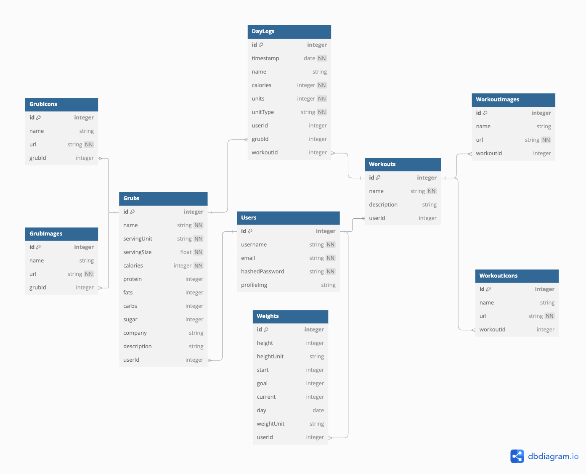

# Calorie Mate

## Database Schema Design


## API Documentation

## USER AUTHENTICATION/AUTHORIZATION

### All endpoints that require authentication
All endpoints that require a current user to be logged in.

* Request: endpoints that require authentication
* Error Response: Require authentication
  * Status Code: 401
  * Headers:
    * Content-Type: application/json
  * Body:

    ```json
    {
      "message": "Authentication required"
    }
    ```

### All endpoints that require proper authorization

All endpoints that require authentication and the current user does not have the
correct role(s) or permission(s).

* Request: endpoints that require proper authorization
* Error Response: Require proper authorization
  * Status Code: 403
  * Headers:
    * Content-Type: application/json
  * Body:

    ```json
    {
      "message": "Forbidden"
    }
    ```

### Get the Current User

Returns the information about the current user that is logged in.

* Require Authentication: false
* Request
  * Method: GET
  * URL: /api/session
  * Body: none

* Successful Response when there is a logged in user
  * Status Code: 200
  * Headers:
    * Content-Type: application/json
  * Body:

    ```json
    {
      "user": {
        "id": 1,
        "firstName": "John",
        "lastName": "Smith",
        "email": "john.smith@gmail.com",
        "username": "JohnSmith"
      }
    }
    ```

* Successful Response when there is no logged in user
  * Status Code: 200
  * Headers:
    * Content-Type: application/json
  * Body:

    ```json
    {
      "user": null
    }
    ```

### Log In a User

Logs in a current user with valid credentials and returns the current user's
information.

* Require Authentication: false
* Request
  * Method: POST
  * URL: /api/session
  * Headers:
    * Content-Type: application/json
  * Body:
    ```json
    {
      "credential": "john.smith@gmail.com",
      "password": "secret password"
    }
    ```

* Successful Response
  * Status Code: 200
  * Headers:
    * Content-Type: application/json
  * Body:

    ```json
    {
      "user": {
        "id": 1,
        "firstName": "John",
        "lastName": "Smith",
        "email": "john.smith@gmail.com",
        "username": "JohnSmith"
      }
    }
    ```

* Error Response: Invalid credentials
  * Status Code: 401
  * Headers:
    * Content-Type: application/json
  * Body:

    ```json
    {
      "message": "Invalid credentials"
    }
    ```

* Error response: Body validation errors
  * Status Code: 400
  * Headers:
    * Content-Type: application/json
  * Body:

    ```json
    {
      "message": "Bad Request", // (or "Validation error" if generated by Sequelize),
      "errors": {
        "credential": "Email or username is required",
        "password": "Password is required"
      }
    }
    ```

### Sign Up a User

Creates a new user, logs them in as the current user, and returns the current
user's information.

* Require Authentication: false
* Request
  * Method: POST
  * URL: /api/users
  * Headers:
    * Content-Type: application/json
  * Body:

    ```json
    {
      "firstName": "John",
      "lastName": "Smith",
      "email": "john.smith@gmail.com",
      "username": "JohnSmith",
      "password": "secret password"
    }
    ```

* Successful Response
  * Status Code: 200
  * Headers:
    * Content-Type: application/json
  * Body:

    ```json
    {
      "user": {
        "id": 1,
        "firstName": "John",
        "lastName": "Smith",
        "email": "john.smith@gmail.com",
        "username": "JohnSmith"
      }
    }
    ```

* Error response: User already exists with the specified email
  * Status Code: 500
  * Headers:
    * Content-Type: application/json
  * Body:

    ```json
    {
      "message": "User already exists",
      "errors": {
        "email": "User with that email already exists"
      }
    }
    ```

* Error response: User already exists with the specified username
  * Status Code: 500
  * Headers:
    * Content-Type: application/json
  * Body:

    ```json
    {
      "message": "User already exists",
      "errors": {
        "username": "User with that username already exists"
      }
    }
    ```

* Error response: Body validation errors
  * Status Code: 400
  * Headers:
    * Content-Type: application/json
  * Body:

    ```json
    {
      "message": "Bad Request", // (or "Validation error" if generated by Sequelize),
      "errors": {
        "email": "Invalid email",
        "username": "Username is required",
        "firstName": "First Name is required",
        "lastName": "Last Name is required"
      }
    }
    ```

## FoodFacts

###  Returns all the FoodFacts.
* Require Authentication: false
* Request
  * Method: GET
  * URL: /api/foodfacts
  * Body: none

* Successful Response
  * Status Code: 200
  * Headers:
    * Content-Type: application/json
  * Body:

    ```json
    {
      "FoodFacts": [
        {
          "id": 1,
          "name": "Big Mac",
          "calories": 500,
          "servingSize": 12,
          "servingUnit": "oz", 
          "quantity": null,
          "protein": 55,
          "fats": 12,
          "carbs": 33,
          "sugar": 1,
          "company": "McDonalds",
          "description":  "This is a description",
          "Icon": 
                  {
                    "id": 1,
                    "name": "chicken",
                    "url": "image.google.com" 
                  },
          "createdAt": "2021-11-19 20:39:36",
          "updatedAt": "2021-11-19 20:39:36"
        }
      ]
    }
    ```


### Get details of a FoodFact from an id
Returns the details of a spot specified by its id.

* Require Authentication: false
* Request
  * Method: GET
  * URL: /api/foodfacts/:foodfactId
  * Body: none

* Successful Response
  * Status Code: 200
  * Headers:
    * Content-Type: application/json
  * Body:

    ```json
        {
          "id": 1,
          "name": "Big Mac",
          "calories": 500,
          "servingSize": 12,
          "servingUnit": "oz", 
          "quantity": null,
          "protein": 55,
          "fats": 12,
          "carbs": 33,
          "sugar": 1,
          "company": "McDonalds",
          "description":  "This is a description",
          "Icon": 
                  {
                    "id": 1,
                    "name": "chicken",
                    "url": "image.google.com" 
                  },
          "createdAt": "2021-11-19 20:39:36",
          "updatedAt": "2021-11-19 20:39:36"
        }
    ```

* Error response: Couldn't find a Spot with the specified id
  * Status Code: 404
  * Headers:
    * Content-Type: application/json
  * Body:

    ```json
    {
      "message": "FoodFact couldn't be found"
    }
    ```

### Create a FoodSpot

Creates and returns a new spot.

* Require Authentication: true
* Request
  * Method: POST
  * URL: /api/foodspot
  * Headers:
    * Content-Type: application/json
  * Body:

    ```json
        {
          "name": "Big Mac",
          "calories": 500,
          "servingSize": 12,
          "servingUnit": "oz", 
          "quantity": null,
          "protein": 55,
          "fats": 12,
          "carbs": 33,
          "sugar": 1,
          "company": "McDonalds",
          "description":  "This is a description",
          "iconId": 1
        }
    ```

* Error Response: Body validation error
  * Status Code: 400
  * Headers:
    * Content-Type: application/json
  * Body:

    ```json
    {
      "message": "Bad Request", // (or "Validation error" if generated by Sequelize),
      "errors": {
        "name": "name is required",
        "calories": "'calories' is required",
        "servingSize": "'servingsize' is required",
        "servingUnit": "'servingunit' is required", 
      }
    }
    ```

* Successful Response
  * Status Code: 200
  * Headers:
    * Content-Type: application/json
  * Body:

    ```json
    {
      "id": 1,
      "name": "Big Mac",
      "calories": 500,
      "servingSize": 12,
      "servingUnit": "oz", 
      "quantity": null,
      "protein": 55,
      "fats": 12,
      "carbs": 33,
      "sugar": 1,
      "company": "McDonalds",
      "description":  "This is a description",
      "Icon": 
              {
                "id": 1,
                "name": "chicken",
                "url": "image.google.com" 
              },
      "createdAt": "2021-11-19 20:39:36",
      "updatedAt": "2021-11-19 20:39:36"
    }

### Edit a FoodFact

Updates and returns an existing spot.

* Require Authentication: true
* Require proper authorization: Spot must belong to the current user
* Request
  * Method: PUT
  * URL: /api/foodfact/:foodfactId
  * Headers:
    * Content-Type: application/json
  * Body:

    ```json
    {
      "id": 1,
      "name": "Big Mac",
      "calories": 500,
      "servingSize": 12,
      "servingUnit": "oz", 
      "quantity": null,
      "protein": 55,
      "fats": 12,
      "carbs": 33,
      "sugar": 1,
      "company": "McDonalds",
      "description":  "This is a description",
      "IconId": 1
    }
    ```

* Successful Response
  * Status Code: 200
  * Headers:
    * Content-Type: application/json
  * Body:

    ```json
      {
        "id": 1,
        "name": "Big Mac",
        "calories": 500,
        "servingSize": 12,
        "servingUnit": "oz", 
        "quantity": null,
        "protein": 55,
        "fats": 12,
        "carbs": 33,
        "sugar": 1,
        "company": "McDonalds",
        "description":  "This is a description",
        "Icon": 
                {
                  "id": 1,
                  "name": "chicken",
                  "url": "image.google.com" 
                },
        "createdAt": "2021-11-19 20:39:36",
        "updatedAt": "2021-11-19 20:39:36"
      }
    ```

* Error Response: Body validation error
  * Status Code: 400
  * Headers:
    * Content-Type: application/json
  * Body:

    ```json
    {
      "message": "Bad Request", // (or "Validation error" if generated by Sequelize),
      "errors": {
        "name": "name is required",
        "calories": "'calories' is required",
        "servingSize": "'servingsize' is required",
        "servingUnit": "'servingunit' is required", 
      }
    }
    ```

* Error response: Couldn't find a Spot with the specified id
  * Status Code: 404
  * Headers:
    * Content-Type: application/json
  * Body:

    ```json
    {
      "message": "FoodFact couldn't be found"
    }
    ```

### Delete a FoodFact

Deletes an existing spot.

* Require Authentication: true
* Require proper authorization: Spot must belong to the current user
* Request
  * Method: DELETE
  * URL: /api/foodfact/:foodfactId
  * Body: none

* Successful Response
  * Status Code: 200
  * Headers:
    * Content-Type: application/json
  * Body:

    ```json
    {
      "message": "Successfully deleted"
    }
    ```

* Error response: Couldn't find a Spot with the specified id
  * Status Code: 404
  * Headers:
    * Content-Type: application/json
  * Body:

    ```json
    {
      "message": "FoodFact couldn't be found"
    }
    ```


## Excercises

### Returns all the Excercises.

* Require Authentication: false
* Request
  * Method: GET
  * URL: /api/excercises
  * Body: none

* Successful Response
  * Status Code: 200
  * Headers:
    * Content-Type: application/json
  * Body:

    ```json
    {
      "Excercises": [
        {
          "id": 1,
          "name": "Walking",
          "calories": 500,
          "unit": "minutes",
          "quantity": null, 
          "timestamp": null,
          "description": "text",
          "Icon": 
            {
                "id": 1,
                "name": "chicken",
                "url": "image.google.com" 
            },
          "createdAt": "2021-11-19 20:39:36",
          "updatedAt": "2021-11-19 20:39:36"
        }
      ]
    }
    ```


### Get details of a Excercise from an id

Returns the details of a Excercise specified by its id.

* Require Authentication: false
* Request
  * Method: GET
  * URL: /api/excercises/:excerciseId
  * Body: none

* Successful Response
  * Status Code: 200
  * Headers:
    * Content-Type: application/json
  * Body:

    ```json
        {
          "id": 1,
          "name": "Walking",
          "calories": 500,
          "unit": "minutes",
          "quantity": null, 
          "timestamp": null,
          "description": "text",
          "Icon": 
            {
                "id": 1,
                "name": "chicken",
                "url": "image.google.com" 
            },
          "createdAt": "2021-11-19 20:39:36",
          "updatedAt": "2021-11-19 20:39:36"
        }
    ```

* Error response: Couldn't find a Spot with the specified id
  * Status Code: 404
  * Headers:
    * Content-Type: application/json
  * Body:

    ```json
    {
      "message": "Excercise couldn't be found"
    }
    ```

### Create a Excercise

Creates and returns a new Excercise.

* Require Authentication: true
* Request
  * Method: POST
  * URL: /api/excercises
  * Headers:
    * Content-Type: application/json
  * Body:

    ```json
    {
        "name": "Walking",
        "decription": "Before sleeping",
        "iconId": 1
    }
    ```

  * Successful Response
  * Status Code: 200
  * Headers:
    * Content-Type: application/json
  * Body:

    ```json
        {
          "id": 1,
          "name": "Walking",
          "calories": 500,
          "unit": "minutes",
          "quantity": null, 
          "timestamp": null,
          "description": "Before sleeping",
          "Icon": 
            {
                "id": 1,
                "name": "chicken",
                "url": "image.google.com" 
            },
          "createdAt": "2021-11-19 20:39:36",
          "updatedAt": "2021-11-19 20:39:36"
        }

    ```

* Error Response: Body validation error
  * Status Code: 400
  * Headers:
    * Content-Type: application/json
  * Body:

    ```json
    {
      "message": "Bad Request", // (or "Validation error" if generated by Sequelize),
      "errors": {
        "name": "name is required",
      }
    }
    ```

### Edit a Excercise

Updates and returns an existing spot.

* Require Authentication: true
* Require proper authorization: Spot must belong to the current user
* Request
  * Method: PUT
  * URL: /api/excercises/:excerciseId
  * Headers:
    * Content-Type: application/json
  * Body:

    ```json
    {
        "name": "Walking",
        "decription": "Before sleeping",
        "iconId": 1
    }

    ```

* Successful Response
  * Status Code: 200
  * Headers:
    * Content-Type: application/json
  * Body:

    ```json
      {
        "id": 1,
        "name": "Walking",
        "calories": 500,
        "unit": "minutes",
        "quantity": null, 
        "timestamp": null,
        "description": "Before sleeping",
        "Icon": 
          {
              "id": 1,
              "name": "chicken",
              "url": "image.google.com" 
          },
        "createdAt": "2021-11-19 20:39:36",
        "updatedAt": "2021-11-19 20:39:36"
      }
    ```

* Error Response: Body validation error
  * Status Code: 400
  * Headers:
    * Content-Type: application/json
  * Body:

    ```json
    {
      "message": "Bad Request", // (or "Validation error" if generated by Sequelize),
      "errors": {
        "name": "name is required"
      }
    }
    ```

* Error response: Couldn't find a Excercise with the specified id
  * Status Code: 404
  * Headers:
    * Content-Type: application/json
  * Body:

    ```json
    {
      "message": "Excercise couldn't be found"
    }
    ```

### Delete a Excercise

Deletes an existing excercise.

* Require Authentication: true
* Require proper authorization: Spot must belong to the current user
* Request
  * Method: DELETE
  * URL: /api/excercise/:excerciseId
  * Body: none

* Successful Response
  * Status Code: 200
  * Headers:
    * Content-Type: application/json
  * Body:

    ```json
    {
      "message": "Successfully deleted"
    }
    ```

* Error response: Couldn't find a Spot with the specified id
  * Status Code: 404
  * Headers:
    * Content-Type: application/json
  * Body:

    ```json
    {
      "message": "Excercise couldn't be found"
    }
    ```

## Recipes

###  Returns all the Recipes.

* Require Authentication: false
* Request
  * Method: GET
  * URL: /api/recipes
  * Body: none

* Successful Response
  * Status Code: 200
  * Headers:
    * Content-Type: application/json
  * Body:

    ```json
    {
      "Recipes": [
        {
          "id": 1,
          "timestamp": null,
          "description": null,
          "FoodFact":
            {
              "id": 1,
              "name": "Big Mac",
              "calories": 500,
              "servingSize": 12,
              "servingUnit": "oz", 
              "quantity": null,
              "protein": 55,
              "fats": 12,
              "carbs": 33,
              "sugar": 1,
              "company": "McDonalds",
              "description":  "This is a description",
              "Icon": 
                {
                  "id": 1,
                  "name": "chicken",
                  "url": "image.google.com" 
                },
            },
          "Icon": 
              {
                "id": 1,
                "name": "chicken",
                "url": "image.google.com" 
              },
          "user": {
                "id": 1,
                "firstName": "John",
                "lastName": "Smith",
                "email": "john.smith@gmail.com",
                "username": "JohnSmith"
          },
          "createdAt": "2021-11-19 20:39:36",
          "updatedAt": "2021-11-19 20:39:36"
        }
      ]
    }
    ```


### Get details of a Recipe from an id

Returns the details of a spot specified by its id.

* Require Authentication: false
* Request
  * Method: GET
  * URL: /api/recipes/:recipeId
  * Body: none

* Successful Response
  * Status Code: 200
  * Headers:
    * Content-Type: application/json
  * Body:

    ```json
      {
          "id": 1,
          "timestamp": null,
          "description": null,
          "FoodFact":
            {
              "id": 1,
              "name": "Big Mac",
              "calories": 500,
              "servingSize": 12,
              "servingUnit": "oz", 
              "quantity": null,
              "protein": 55,
              "fats": 12,
              "carbs": 33,
              "sugar": 1,
              "company": "McDonalds",
              "description":  "This is a description",
              "Icon": 
                {
                  "id": 1,
                  "name": "chicken",
                  "url": "image.google.com" 
                },
            },
          "Icon": 
              {
                "id": 1,
                "name": "chicken",
                "url": "image.google.com" 
              },
          "user": {
                "id": 1,
                "firstName": "John",
                "lastName": "Smith",
                "email": "john.smith@gmail.com",
                "username": "JohnSmith"
          },
          "createdAt": "2021-11-19 20:39:36",
          "updatedAt": "2021-11-19 20:39:36"
        }
    ```

* Error response: Couldn't find a Spot with the specified id
  * Status Code: 404
  * Headers:
    * Content-Type: application/json
  * Body:

    ```json
    {
      "message": "FoodFact couldn't be found"
    }
    ```

### Create a Recipe

Creates and returns a new spot.

* Require Authentication: true
* Request
  * Method: POST
  * URL: /api/recipe
  * Headers:
    * Content-Type: application/json
  * Body:
  ```json
    {
      "description": "Another boring description",
      "timestamp": null,
      "foodFactId": 2,
      "userId": 1,
      "iconId":3
    }
  ```


  * Successful Response
  * Status Code: 200
  * Headers:
    * Content-Type: application/json
  * Body:

    ```json
      {
          "id": 1,
          "timestamp": null,
          "description": null,
          "FoodFact":
            {
              "id": 1,
              "name": "Big Mac",
              "calories": 500,
              "servingSize": 12,
              "servingUnit": "oz", 
              "quantity": null,
              "protein": 55,
              "fats": 12,
              "carbs": 33,
              "sugar": 1,
              "company": "McDonalds",
              "description":  "This is a description",
              "Icon": 
                {
                  "id": 1,
                  "name": "chicken",
                  "url": "image.google.com" 
                },
            },
          "Icon": 
              {
                "id": 1,
                "name": "chicken",
                "url": "image.google.com" 
              },
          "user": {
                "id": 1,
                "firstName": "John",
                "lastName": "Smith",
                "email": "john.smith@gmail.com",
                "username": "JohnSmith"
          },
          "createdAt": "2021-11-19 20:39:36",
          "updatedAt": "2021-11-19 20:39:36"
        }
    ```

* Error Response: Body validation error
  * Status Code: 400
  * Headers:
    * Content-Type: application/json
  * Body:

    ```json
    {
      "message": "Bad Request", // (or "Validation error" if generated by Sequelize),
      "errors": {
        "name": "name is required",
        "calories": "'calories' is required",
        "servingSize": "'servingsize' is required",
        "servingUnit": "'servingunit' is required", 
      }
    }
    ```

### Edit a Recipe

Updates and returns an existing spot.

* Require Authentication: true
* Require proper authorization: Spot must belong to the current user
* Request
  * Method: PUT
  * URL: /api/foodfact/:foodfactId
  * Headers:
    * Content-Type: application/json
  * Body:

    ```json
    {
        "id": 1,
        "foodFactId": 3,
        "userId": 1,
        "iconId": 12,
        "description": "This is a description",
    }
    ```

* Successful Response
  * Status Code: 200
  * Headers:
    * Content-Type: application/json
  * Body:

    ```json
      {
          "id": 1,
          "timestamp": null,
          "description": null,
          "FoodFact":
            {
              "id": 1,
              "name": "Big Mac",
              "calories": 500,
              "servingSize": 12,
              "servingUnit": "oz", 
              "quantity": null,
              "protein": 55,
              "fats": 12,
              "carbs": 33,
              "sugar": 1,
              "company": "McDonalds",
              "description":  "This is a description",
              "Icon": 
                {
                  "id": 1,
                  "name": "chicken",
                  "url": "image.google.com" 
                },
            },
          "Icon": 
              {
                "id": 1,
                "name": "chicken",
                "url": "image.google.com" 
              },
          "user": {
                "id": 1,
                "firstName": "John",
                "lastName": "Smith",
                "email": "john.smith@gmail.com",
                "username": "JohnSmith"
          },
          "createdAt": "2021-11-19 20:39:36",
          "updatedAt": "2021-11-19 20:39:36"
        }
    ```

* Error Response: Body validation error
  * Status Code: 400
  * Headers:
    * Content-Type: application/json
  * Body:

    ```json
    {
      "message": "Bad Request", // (or "Validation error" if generated by Sequelize),
      "errors": {
        "name": "name is required",
        "calories": "'calories' is required",
        "servingSize": "'servingsize' is required",
        "servingUnit": "'servingunit' is required", 
      }
    }
    ```

* Error response: Couldn't find a Spot with the specified id
  * Status Code: 404
  * Headers:
    * Content-Type: application/json
  * Body:

    ```json
    {
      "message": "Recipe couldn't be found"
    }
    ```

### Delete a Recipe

Deletes an existing recipe.

* Require Authentication: true
* Require proper authorization: Spot must belong to the current user
* Request
  * Method: DELETE
  * URL: /api/recipes/:recipeId
  * Body: none

* Successful Response
  * Status Code: 200
  * Headers:
    * Content-Type: application/json
  * Body:

    ```json
    {
      "message": "Successfully deleted"
    }
    ```

* Error response: Couldn't find a Spot with the specified id
  * Status Code: 404
  * Headers:
    * Content-Type: application/json
  * Body:

    ```json
    {
      "message": "Recipe couldn't be found"
    }
    ```

## Icons

### Returns all icons
Returns the details of a spot specified by its id.

* Require Authentication: false
* Request
  * Method: GET
  * URL: /api/icons
  * Body: none

* Successful Response
  * Status Code: 200
  * Headers:
    * Content-Type: application/json
  * Body:

    ```json
    {
      "Icons": 
      [
        {
          "id": 1,
          "name": "Chicken Nuggests",
          "url": "image.google.com"
        }
      ]
    }
    ```

* Error response: Couldn't find a Spot with the specified id
  * Status Code: 404
  * Headers:
    * Content-Type: application/json
  * Body:

    ```json
    {
      "message": "Icon couldn't be found"
    }
    ```

### Get details of an Icon from an id
Returns the details of a spot specified by its id.

* Require Authentication: false
* Request
  * Method: GET
  * URL: /api/icons/:iconId
  * Body: none

* Successful Response
  * Status Code: 200
  * Headers:
    * Content-Type: application/json
  * Body:

    ```json
    {
      "id": 1,
      "name": "Chicken Nuggests",
      "url": "image.google.com"
    }
    ```

* Error response: Couldn't find a Spot with the specified id
  * Status Code: 404
  * Headers:
    * Content-Type: application/json
  * Body:

    ```json
    {
      "message": "Icon couldn't be found"
    }
    ```


### Edit a icon 

Updates and returns an icon.

* Require Authentication: true
* Require proper authorization: Spot must belong to the current user
* Request
  * Method: PUT
  * URL: /api/icons/:iconId
  * Headers:
    * Content-Type: application/json
  * Body:

    ```json
    {
        "name": "Burger King",
        "url": "image.google.com/2",
    }
    ```

* Successful Response
  * Status Code: 200
  * Headers:
    * Content-Type: application/json
  * Body:

    ```json
    {
        "id": 1,
        "name": "Burger King",
        "url": "image.google.com/2",
    }
    ```

* Error Response: Body validation error
  * Status Code: 400
  * Headers:
    * Content-Type: application/json
  * Body:

    ```json
    {
      "message": "Bad Request", // (or "Validation error" if generated by Sequelize),
      "errors": {
        "name": "name is required",
        "url": "'url' is required",
      }
    }
    ```

* Error response: Couldn't find a Spot with the specified id
  * Status Code: 404
  * Headers:
    * Content-Type: application/json
  * Body:

    ```json
    {
      "message": "icon couldn't be found"
    }
    ```

### Delete a icon
Deletes an existing icon.

* Require Authentication: true
* Require proper authorization: Spot must belong to the current user
* Request
  * Method: DELETE
  * URL: /api/icons/:iconId
  * Body: none

* Successful Response
  * Status Code: 200
  * Headers:
    * Content-Type: application/json
  * Body:

    ```json
    {
      "message": "Successfully deleted"
    }
    ```

* Error response: Couldn't find a Spot with the specified id
  * Status Code: 404
  * Headers:
    * Content-Type: application/json
  * Body:

    ```json
    {
      "message": "Icon couldn't be found"
    }
    ```


## DayLogs

###  Returns all the DayLogs.

* Require Authentication: false
* Request
  * Method: GET
  * URL: /api/daylogs
  * Body: none

* Successful Response
  * Status Code: 200
  * Headers:
    * Content-Type: application/json
  * Body:

    ```json
    "Daylogs": [
    {
        "id": 1,
        "day": "2021-11-19 20:39:36",
        "description": "My description",
        "Recipes":[
        {
            "id": 1,
            "recipeId": 3,
            "excerciseId": 1,
            "userId": 2,
            "description": "This is a description",
            "Icon": 
                {
                    "id": 1,
                    "name": "chicken",
                    "url": "image.google.com" 
                },
            "createdAt": "2021-11-19 20:39:36",
            "updatedAt": "2021-11-19 20:39:36"
        }],
        "Excercises":[
        {
            "id": 1,
            "name": "Walking",
            "iconId": 4,
            "calories": 500,
            "count": 120,
            "counterUnit": "minutes", 
            "timestamp": null,
            "createdAt": "2021-11-19 20:39:36",
            "updatedAt": "2021-11-19 20:39:36",
        }],
        "user": {
            "id": 1,
            "firstName": "John",
            "lastName": "Smith",
            "email": "john.smith@gmail.com",
            "username": "JohnSmith"
        }
    }
    ]
    ```


### Get details of a DayLog from an id

Returns the details of a spot specified by its id.

* Require Authentication: false
* Request
  * Method: GET
  * URL: /api/daylogs/:daylogsId
  * Body: none

* Successful Response
  * Status Code: 200
  * Headers:
    * Content-Type: application/json
  * Body:

    ```json
    {
        "id": 1,
        "day": "2021-11-19 20:39:36",
        "description": "My description",
        "Recipe":[
        {
            "id": 1,
            "recipeId": 3,
            "excerciseId": 1,
            "userId": 2,
            "description": "This is a description",
            "Icon": 
              {
                  "id": 1,
                  "name": "chicken",
                  "url": "image.google.com" 
              },
            "createdAt": "2021-11-19 20:39:36",
            "updatedAt": "2021-11-19 20:39:36"
        }],
        "Excercise":[
        {
            "id": 1,
            "name": "Walking",
            "iconId": 4,
            "calories": 500,
            "count": 120,
            "counterUnit": "minutes", 
            "timestamp": null,
            "Icon": 
              {
                  "id": 1,
                  "name": "chicken",
                  "url": "image.google.com" 
              },
        }],
        "user": {
            "id": 1,
            "firstName": "John",
            "lastName": "Smith",
            "email": "john.smith@gmail.com",
            "username": "JohnSmith"
        },
        "Icon": 
          {
              "id": 1,
              "name": "chicken",
              "url": "image.google.com" 
          },
    }
    ```

* Error response: Couldn't find a Spot with the specified id
  * Status Code: 404
  * Headers:
    * Content-Type: application/json
  * Body:

    ```json
    {
      "message": "FoodFact couldn't be found"
    }
    ```

### Create a DayLog

Creates and returns a new spot.

* Require Authentication: true
* Request
  * Method: POST
  * URL: /api/daylogs
  * Headers:
    * Content-Type: application/json
  * Body:

    ```json
    {
        "id": 1,
        "day": "2021-11-19 20:39:36",
        "description": "This is a description"
    }
    ```

* Error Response: Body validation error
  * Status Code: 400
  * Headers:
    * Content-Type: application/json
  * Body:

    ```json
    {
      "message": "Bad Request", // (or "Validation error" if generated by Sequelize),
      "errors": {
        "day": "day is required",
        "calories": "'calories' is required",
        "servingSize": "'servingsize' is required",
        "servingUnit": "'servingunit' is required", 
      }
    }
    ```

### Edit a Recipe

Updates and returns an existing spot.

* Require Authentication: true
* Require proper authorization: Spot must belong to the current user
* Request
  * Method: PUT
  * URL: /api/foodfact/:foodfactId
  * Headers:
    * Content-Type: application/json
  * Body:

    ```json
    {
        "id": 1,
        "foodFactId": 3,
        "userId": 1,
        "iconId": 12,
        "description": "This is a description",
    }
    ```

* Successful Response
  * Status Code: 200
  * Headers:
    * Content-Type: application/json
  * Body:

    ```json
    {
        "id": 1,
        "foodFactId": 3,
        "userId": 1,
        "iconId": 12,
        "description": "This is a description",
    }
    ```

* Error Response: Body validation error
  * Status Code: 400
  * Headers:
    * Content-Type: application/json
  * Body:

    ```json
    {
      "message": "Bad Request", // (or "Validation error" if generated by Sequelize),
      "errors": {
        "name": "name is required",
        "calories": "'calories' is required",
        "servingSize": "'servingsize' is required",
        "servingUnit": "'servingunit' is required", 
      }
    }
    ```

* Error response: Couldn't find a Spot with the specified id
  * Status Code: 404
  * Headers:
    * Content-Type: application/json
  * Body:

    ```json
    {
      "message": "Recipe couldn't be found"
    }
    ```

### Delete a DayLogs

Deletes an existing DayLog.

* Require Authentication: true
* Require proper authorization: Spot must belong to the current user
* Request
  * Method: DELETE
  * URL: /api/daylogs/:dayLogId
  * Body: none

* Successful Response
  * Status Code: 200
  * Headers:
    * Content-Type: application/json
  * Body:

    ```json
    {
      "message": "Successfully deleted"
    }
    ```

* Error response: Couldn't find a Spot with the specified id
  * Status Code: 404
  * Headers:
    * Content-Type: application/json
  * Body:

    ```json
    {
      "message": "DayLog couldn't be found"
    }
    ```


